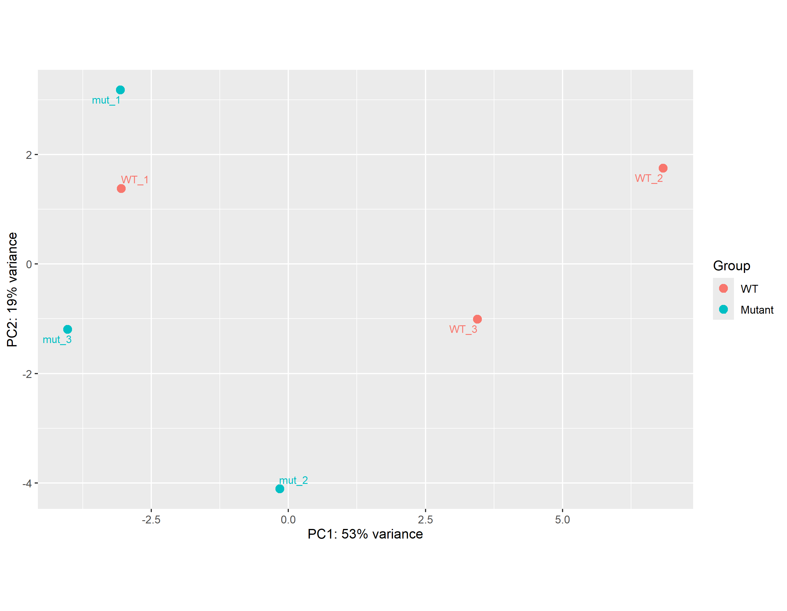
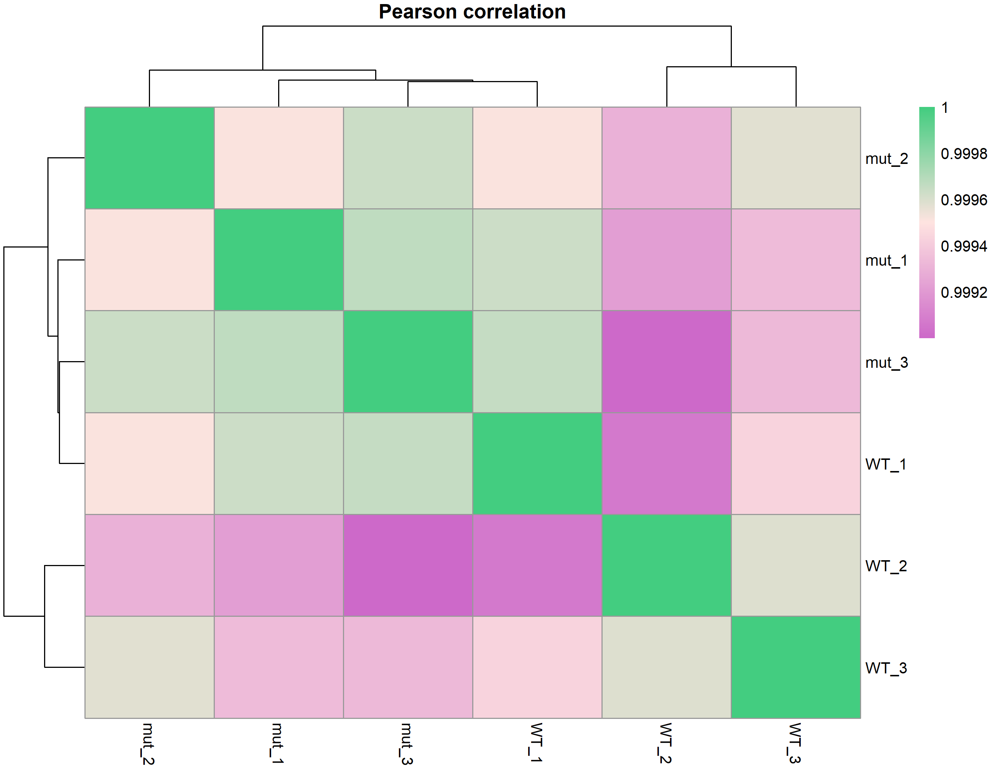
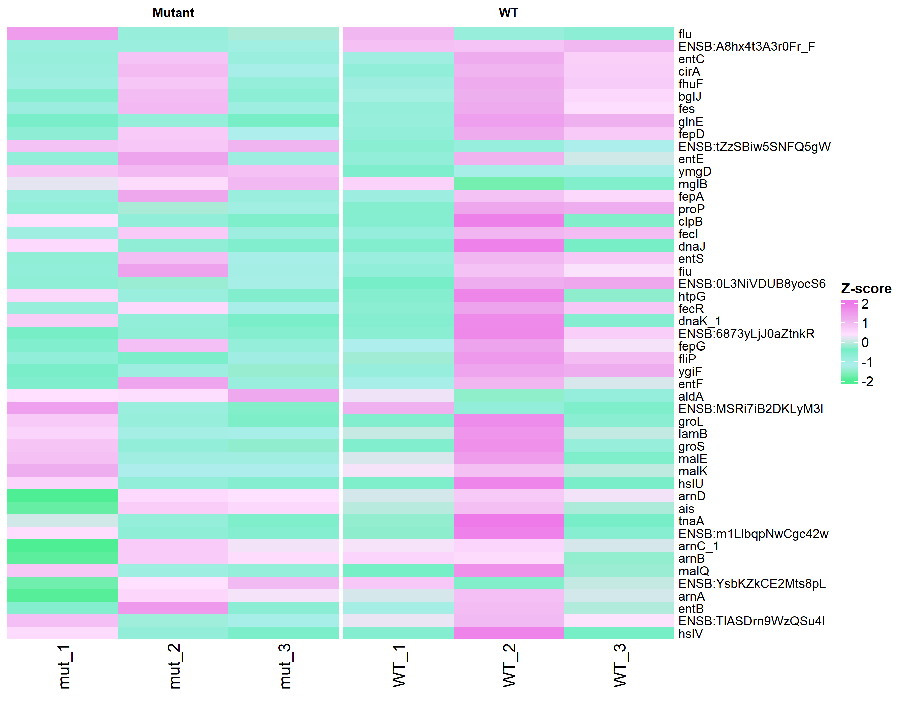
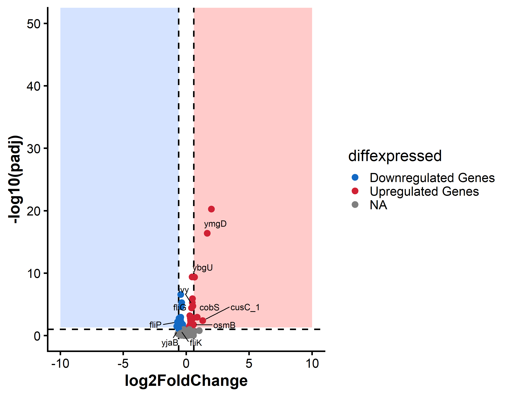
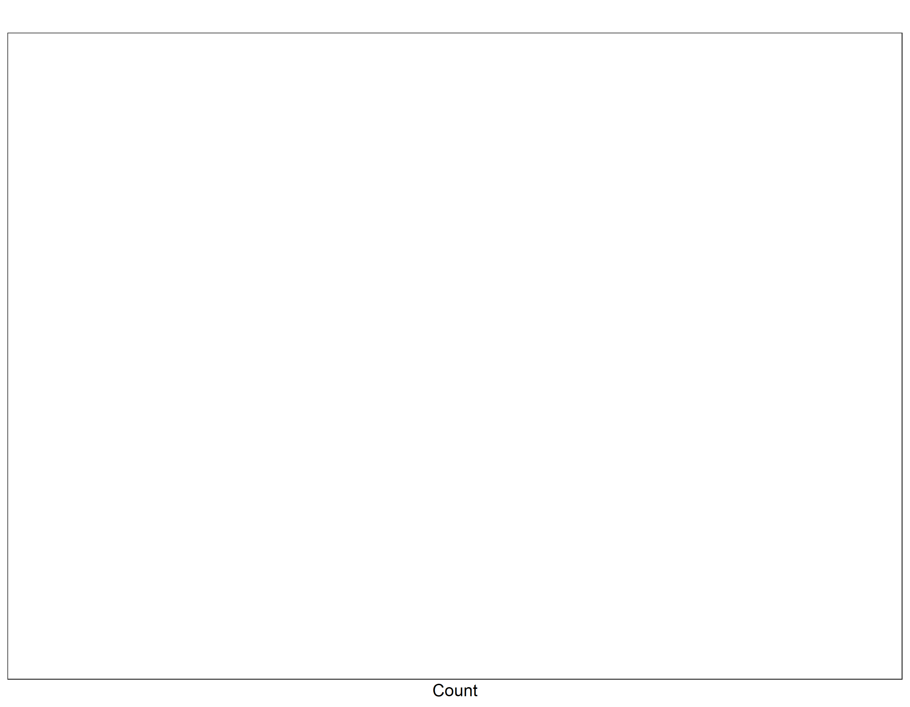
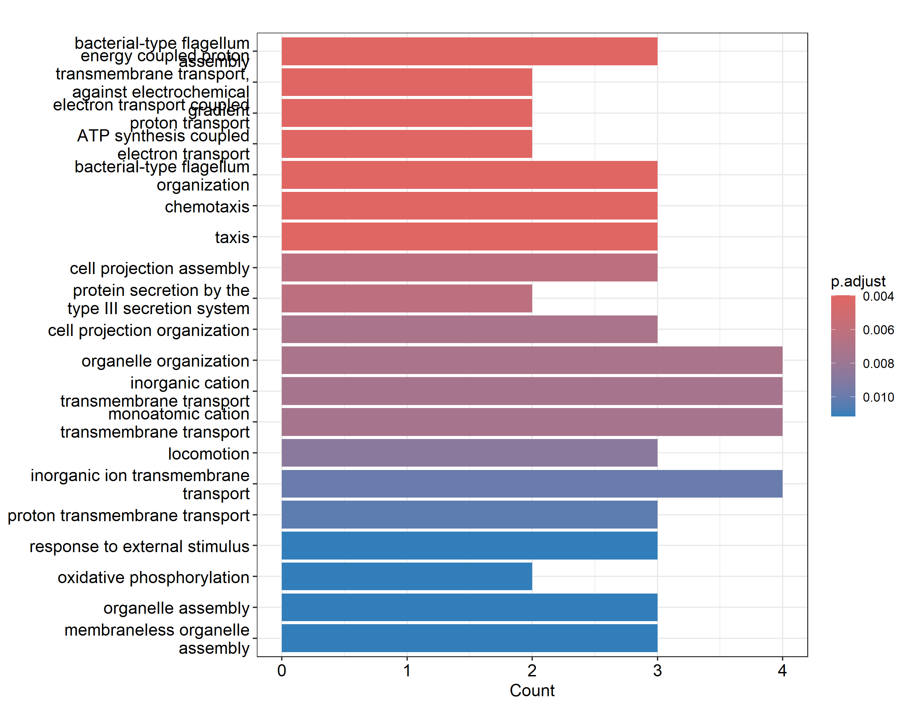
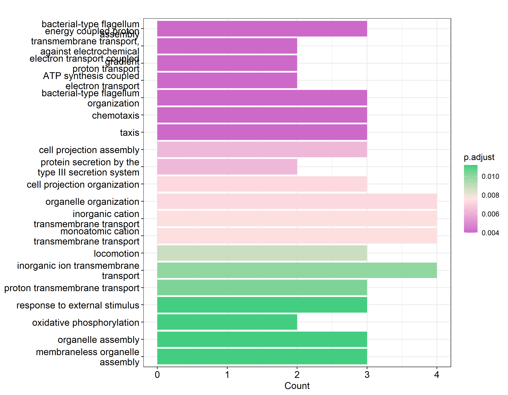

Bioinformatic Analyst Report Workflow
================
Garcia Rivas, J.
2026-07-23

## R Markdown

# Integration script

This is the workflow performed to generate a report of the analysis
performed with the E.coli samples provided. This Rmarkdown script is
fully reproducible as well as providing the output for the different
parameters (e.g. QCs) used for the analysis.

# Libraries needed

``` r
library(BiocManager)
library(DESeq2)
library(tibble)
library(ggplot2)
library(ggrepel)
library(AnnotationDbi)
library(org.EcK12.eg.db)
library(rtracklayer)
library(dplyr)
library(gprofiler2)
library(clusterProfiler)
library(readr)
```

# Importing all of the files from Linux into R

``` r
#Adding gene IDs to the counts file
gtf <- import("E:/Bioinformatics Position/Escherichia_coli_k_12_gca_004802935.ASM480293v1.63.gtf/Escherichia_coli_k_12_gca_004802935.ASM480293v1.63.gtf")
gtf <- as.data.frame(gtf)
counts <- read_csv("FeatureCounts mutvsWT.csv")
gene_map <- gtf %>% select(gene_id, gene_name) %>% filter(!is.na(gene_id)) %>% distinct()

#Merging Symbol into Count Matrix
counts_annotated <- merge(counts, gene_map, by.x = 'Geneid', by.y = 'gene_id', all.x = T)
counts_annotated$gene_name <- ifelse(is.na(counts_annotated$gene_name), counts_annotated$Geneid, counts_annotated$gene_name)
counts_annotated <- counts_annotated %>% remove_rownames %>% column_to_rownames(var = 'gene_name')
counts_annotated <- counts_annotated[,-1]

#Reading Sample Info Files
sampleInfo <- read_csv("Sample info mut vs wt.csv")
sampleInfo <- sampleInfo %>% remove_rownames %>% column_to_rownames(var = 'Sample')

#making sure our sample info and our matrix match in sample ID and order
all(colnames(counts_annotated) %in% rownames(sampleInfo))
```

    ## [1] TRUE

``` r
all(colnames(counts_annotated) == rownames(sampleInfo))
```

    ## [1] TRUE

# Analyzing the counts using DESeq2

``` r
#Construct DESEQ2 object
counts_dds <- DESeqDataSetFromMatrix(countData = counts_annotated, 
                                       colData = sampleInfo,
                                       design = ~Group)
#Prefiltering so Differential analysis is faster:removing rows with low gene counts
keep <- rowSums(counts(counts_dds)) >=10
counts_dds <- counts_dds[keep, ]

#Set factor level (AKA comparison)
counts_dds$Group <- relevel(counts_dds$Group, ref = 'WT')

#Run DeSEQ
counts_dds <- DESeq(counts_dds)
counts_results <- results(counts_dds, alpha = 0.1)
counts_results_df <- as.data.frame(counts_results)

#Explore Results
summary(counts_results)
```

    ## 
    ## out of 4029 with nonzero total read count
    ## adjusted p-value < 0.1
    ## LFC > 0 (up)       : 41, 1%
    ## LFC < 0 (down)     : 33, 0.82%
    ## outliers [1]       : 0, 0%
    ## low counts [2]     : 625, 16%
    ## (mean count < 93)
    ## [1] see 'cooksCutoff' argument of ?results
    ## [2] see 'independentFiltering' argument of ?results

# Exploring similarities between samples

``` r
#Exploring results and seeing variance in samples with a PCA plot
Pseudo_subset_vsd <- vst(counts_dds, blind = T)
nudge <- position_nudge(x = 0.5, y =2)
plotPCA(Pseudo_subset_vsd, intgroup = 'Group') + labs(color = 'Group') +  geom_text_repel(mapping = aes(label = rownames(sampleInfo)), 
                                                                                          size = 3)
```



``` r
#Making a Pearson Correlation Plot
palette.go <- colorRampPalette(c('orchid3', 'mistyrose', 'seagreen3'))
counts_rlog <- rlog(counts_dds, blind = F)
rlog.counts <- assay(counts_rlog)
colnames(rlog.counts) <- row.names(sampleInfo)
counts_PCC <- cor(rlog.counts, method = 'pearson')
counts_PCC %>%
  as.matrix %>%
  pheatmap::pheatmap(., main = "Pearson correlation", color = palette.go(200))
```



``` r
#Making a heatmap with the genes that drive PC1 and PC2
row_var <- rowVars(assay(Pseudo_subset_vsd))
keep <- order(row_var, decreasing = T)[seq_len(min(500, length(row_var)))]
vsd_top <- assay(Pseudo_subset_vsd)[keep, ]

#Getting the genes that drive the variance
pca <- prcomp(t(vsd_top))
loadings <- pca$rotation

#Selecting the top gene for the heatmaps
top_pc1_genes <- names(sort(abs(loadings[, 'PC1']), decreasing = T)[1:30])
top_pc2_genes <- names(sort(abs(loadings[, 'PC2']), decreasing = T)[1:30])
top_pc_genes <- unique(c(top_pc1_genes, top_pc2_genes))

#Making the heatmap
heatmap_mat <- assay(Pseudo_subset_vsd)[top_pc_genes, ]
heatmap_mat.t <- t(heatmap_mat)
heatmap_mat <- scale(heatmap_mat.t, scale = T, center = T)
heatmap_mat <- t(heatmap_mat)
library(ComplexHeatmap)
palette <- colorRampPalette(c('seagreen2', 'paleturquoise', 'aquamarine2',
                              'thistle1', 'plum2', 'orchid2'))

p1 <- Heatmap(heatmap_mat, cluster_rows = F, cluster_columns = F, column_labels = colnames(heatmap_mat), 
              name = 'Z-score', row_labels = rownames(heatmap_mat),
              column_split = factor(sampleInfo$Group, levels = c('Mutant', 'WT')),
              col = palette(6), row_names_gp = gpar(fontsize = 9), column_title_gp = gpar(fontsize = 9, fontface = 'bold'), 
              show_column_names =  T)

p1
```



# Making a Volcano plot

``` r
counts_results_df$diffexpressed[counts_results_df$padj >= 2.5] <- 'NO'
counts_results_df$diffexpressed[counts_results_df$log2FoldChange > 0 & counts_results_df$padj <= 0.1] <- 'UP'
counts_results_df$diffexpressed[counts_results_df$log2FoldChange < 0 & counts_results_df$padj <= 0.1] <- 'DOWN'

#Adding a metadata column with labels for top 25 up and downregulated genes
top_up_genes <- counts_results_df %>% filter(diffexpressed == 'UP') %>% arrange(desc(log2FoldChange)) %>% head(10)
top_down_genes <- counts_results_df %>% filter(diffexpressed == 'DOWN') %>% arrange(log2FoldChange) %>% head(10)
gene_labels <- rbind(top_up_genes, top_down_genes)
gene_labels$gene <- row.names(gene_labels)
genes <- c('ymgD', 'cusC_1', 'cobS', 'ybgU', 'ivy', 'osmB', 'fliP', 'yjaB', 'flil', 'fliG', 'fliK')
gene_labels$gene <- ifelse(gene_labels$gene %in% genes, gene_labels$gene, NA)

#Making the ggplot object
theme_set(theme_classic(base_size = 20) +
            theme(axis.title.y = element_text(face = 'bold'),
                  axis.title.x = element_text(face = 'bold')))

ggplot(data = counts_results_df, aes(x = log2FoldChange, y = -log10(padj))) + 
  annotate('rect', xmin = -0.6, xmax = -10, ymin = -log10(0.05), ymax = 500, alpha = 1, fill = '#d5e3ff') +
  annotate('rect', xmin = 0.6, xmax = 10, ymin = -log10(0.05), ymax = 500, alpha = 1, fill = '#ffcbca') +
  geom_vline(xintercept = c(-0.6, 0.6), col = 'black', linetype = 'dashed') +
  geom_hline(yintercept = -log10(0.1), col = 'black', linetype = 'dashed') +
  geom_point(aes(color = diffexpressed), size = 3) +
  scale_color_manual(values = c('DOWN' = "#1369c4", 'NO' = "grey", 'UP' = '#d02134'),
                     labels =  c('Downregulated Genes', 'Upregulated Genes', 'NA' )) +
  coord_cartesian(ylim = c(0, 50), xlim = c(-10, 10)) +
  geom_text_repel(data = gene_labels, aes(label = gene), max.overlaps = Inf, 
                  box.padding = 0.5, point.padding = 0.5) 
```



# Making GO Pathways

``` r
#Up regulated genes
counts_subset <- subset(counts_results_df, padj <= 0.05)
palette.go <- colorRampPalette(c('orchid3', 'mistyrose', 'seagreen3'))
up_reg_genes <- rownames(counts_subset[counts_subset$log2FoldChange > 0,])
Go_results_up <- enrichGO(gene = up_reg_genes, OrgDb = 'org.EcK12.eg.db',  keyType = 'ALIAS', ont = 'BP')
Go_results_up_graph <- plot(barplot(Go_results_up, showCategory = 20))
```


``` r
Go_results_up_graph <- Go_results_up_graph + scale_fill_gradientn(colours = palette.go(3))
Go_results_up_graph
```



``` r
#Down regulated genes
down_reg_genes <- rownames(counts_subset[counts_subset$log2FoldChange < 0,])
Go_results_down <- enrichGO(gene = down_reg_genes, OrgDb = 'org.EcK12.eg.db', keyType = 'ALIAS', ont = 'BP')
Go_results_down_graph <- plot(barplot(Go_results_down, showCategory = 20))
```



``` r
Go_results_down_graph <- Go_results_down_graph + scale_fill_gradientn(colours = palette.go(3))
Go_results_down_graph
```


